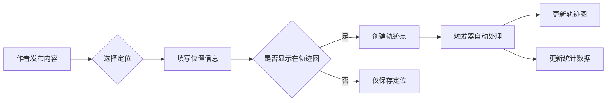

# 旅行轨迹记录平台 - 产品需求文档 (PRD) v3.0

**版本**: v3.0 (优化版)  
**创建时间**: 2025年11月18日  
**技术栈**: Next.js 16 + Supabase + PostgreSQL + PostGIS  
**文档状态**: 技术方案优化版 - 跨平台架构设计  
**目标平台**: Web + 微信小程序 + APP (iOS/Android)

---

## 📋 目录

1. [产品概述](#1-产品概述)
2. [核心业务逻辑](#2-核心业务逻辑)
3. [技术架构](#3-技术架构)
4. [数据模型设计](#4-数据模型设计)
5. [API 接口设计](#5-api-接口设计)
6. [页面功能设计](#6-页面功能设计)
7. [跨平台适配方案](#7-跨平台适配方案)
8. [权限与安全](#8-权限与安全)
9. [性能优化策略](#9-性能优化策略)
10. [开发计划](#10-开发计划)

---

## 1. 产品概述

### 1.1 产品定位

**个人旅行轨迹记录与分享的跨平台生态系统** - 专注于个人旅行经历的系统化记录、数据可视化呈现和社交互动，支持 Web、小程序、APP 多端访问。

### 1.2 核心价值主张

- ✅ **轨迹可视化**：基于发布内容的定位信息生成个人旅行地图
- ✅ **内容管理**：长文章、短动态、专题的分类管理体系
- ✅ **社交互动**：点赞、评论、分享、收藏、赞助等完整功能
- ✅ **数据统计**：自动统计公里数、天数、城市数等核心指标
- ✅ **多端同步**：Web、小程序、APP 数据实时同步
- ✅ **离线能力**：支持离线查看和草稿保存

### 1.3 目标用户

| 用户类型 | 核心需求 | 使用场景 | 优先平台 |
|---------|----------|----------|---------|
| **旅行记录者** | 系统化记录轨迹，生成个人地图 | 发布文章、时光轴，管理照片 | Web(创作) + 小程序(快速记录) |
| **社交互动用户** | 浏览内容，互动交流 | 点赞评论，留言赞助 | 小程序 + APP |
| **内容浏览者** | 浏览精美旅行内容 | 查看文章、照片、轨迹图 | Web + 小程序 |
| **移动端用户** | 随时随地记录旅行瞬间 | 快速拍照、定位、发时光轴 | 小程序 + APP |

### 1.4 产品差异化优势

| 对比项 | 传统博客 | 社交媒体 | 本产品 |
|-------|---------|---------|--------|
| 轨迹可视化 | ❌ | ❌ | ✅ 自动生成地图 |
| 长文创作 | ✅ | ❌ | ✅ Markdown 支持 |
| 实时动态 | ❌ | ✅ | ✅ 时光轴功能 |
| 数据统计 | ❌ | ❌ | ✅ 多维度分析 |
| 多端同步 | ⚠️ 部分 | ✅ | ✅ 实时同步 |
| 离线能力 | ❌ | ❌ | ✅ 草稿本地保存 |

---

## 2. 核心业务逻辑

### 2.1 旅行轨迹生成机制

#### 轨迹点来源

通过**发布文章/时光轴/照片时的定位信息**自动生成



#### 业务规则

- ✅ 只有作者本人可创建轨迹点
- ✅ 轨迹点类型：文章(1)、时光轴(2)、照片(3)
- ✅ 轨迹点是静态的，基于发布时定位
- ✅ 通过 `show_on_track` 字段控制显示
- ✅ 支持轨迹点编辑和删除
- ✅ 自动按时间排序连线

#### 轨迹连线逻辑

| 旅行方式 | 连线颜色 | 图标 | 线条样式 |
|---------|---------|------|---------|
| 驾车/自驾 | #E74C3C (红色) | 🚗 | 实线 |
| 骑行 | #3498DB (蓝色) | 🚴 | 实线 |
| 徒步 | #2ECC71 (绿色) | 🚶 | 虚线 |
| 火车/飞机 | #F39C12 (橙色) | ✈️ | 虚线 |
| 未指定 | #95A5A6 (灰色) | 📍 | 点线 |

### 2.2 内容类型体系

#### 旅行文章 (Article)

**特点**：长文创作，详细记录旅行经历

| 字段类型 | 字段名称 | 说明 | 必填 |
|---------|---------|------|------|
| 基础信息 | 标题、摘要、正文 | 支持 Markdown | ✅ |
| 分类标签 | 分类、标签数组 | 便于检索 | ✅ |
| 旅行信息 | 日期、方式、公里数 | 用于统计 | ✅ |
| 位置信息 | 经纬度、地址 | 生成轨迹点 | ✅ |
| 媒体资源 | 封面图、内容图片 | CDN 存储 | ❌ |
| 扩展信息 | 天气、心情、体重等 | JSONB 存储 | ❌ |
| 互动数据 | 浏览、点赞、评论数 | 自动计数 | - |

#### 专题文章 (Special Topic)

**特点**：组织多篇相关文章，形成系列

- 专题名称、描述、封面
- 关联多篇文章（多对多关系）
- 文章在专题中的排序
- 专题统计（文章数、总阅读数）

#### 时光轴 (Timeline Post)

**特点**：轻量级动态，类似朋友圈

| 字段类型 | 字段名称 | 说明 | 限制 |
|---------|---------|------|------|
| 文字内容 | content | 短文字 | ≤ 500字 |
| 图片 | images | JSONB 数组 | 1-9张 |
| 位置 | 经纬度、地址 | 生成轨迹点 | 可选 |
| 里程碑 | milestone | 如"到达拉萨" | 可选 |
| 标签 | mood_tag, weather_tag | 心情、天气 | 可选 |

#### 照片墙 (Photo)

**特点**：独立照片管理系统

- **必填**：照片 URL、分类（风景/美食/人物/文化/其他）
- **选填**：描述、定位、拍摄时间、标签、EXIF 信息
- **功能**：瀑布流展示、大图预览、地理标记

### 2.3 数据统计

#### 用户旅行统计

| 统计项 | 计算规则 | 更新时机 | 存储位置 |
|-------|---------|----------|---------|
| 总公里数 | SUM(travel_distance) | 文章发布/编辑 | user_travel_stats |
| 总天数 | MAX(travel_date) - MIN(travel_date) | 文章发布/编辑 | user_travel_stats |
| 途径城市数 | COUNT(DISTINCT city) | 内容发布 | user_travel_stats |
| 内容数量 | COUNT(articles/timeline/photos) | 内容发布/删除 | user_travel_stats |
| 总获赞数 | SUM(like_count) | 点赞操作 | user_travel_stats |
| 总评论数 | SUM(comment_count) | 评论操作 | user_travel_stats |
| 粉丝数 | COUNT(followers) | 关注操作 | user_travel_stats |

#### 内容互动统计

每个内容都维护以下计数器：
- `view_count` - 浏览次数
- `like_count` - 点赞数
- `comment_count` - 评论数
- `share_count` - 分享数
- `bookmark_count` - 收藏数

### 2.4 业务流程优化

#### 内容发布流程

```
草稿保存 → 本地缓存 → 填写完整信息 → 选择定位 → 预览 → 发布
    ↓
触发器执行：
1. 创建轨迹点（如果有定位）
2. 更新用户统计
3. 更新专题计数（如果关联）
4. 发送通知（粉丝可见）
5. 更新推荐池
```

#### 互动操作流程

```
用户操作 → 权限校验 → 数据库操作 → 更新计数器 → 实时推送
    ↓
optimistic update（乐观更新）
    ↓
失败回滚（前端）
```

---

## 3. 技术架构

### 3.1 系统架构（跨平台）

```
┌─────────────────────────────────────────────────────────────┐
│                        客户端层                              │
├─────────────────────────────────────────────────────────────┤
│  Web 端          │  微信小程序        │  APP (React Native) │
│  (Next.js 16)    │  (Taro/UniApp)    │  (iOS/Android)      │
│  - SSR/SSG       │  - 原生组件        │  - 原生能力         │
│  - 管理后台      │  - 快速记录        │  - 离线支持         │
│  - SEO 优化      │  - 社交分享        │  - 推送通知         │
└─────────────────────────────────────────────────────────────┘
                              ↓
┌─────────────────────────────────────────────────────────────┐
│                      API 网关层                              │
├─────────────────────────────────────────────────────────────┤
│  统一 REST API (Next.js API Routes + Supabase Edge Functions)│
│  - 认证鉴权 (JWT)                                            │
│  - 请求限流                                                   │
│  - 参数校验                                                   │
│  - 响应格式化                                                 │
│  - 错误处理                                                   │
└─────────────────────────────────────────────────────────────┘
                              ↓
┌─────────────────────────────────────────────────────────────┐
│                    Supabase 服务层                           │
├─────────────────────────────────────────────────────────────┤
│  ├─ Auth            - 用户认证（Email/OAuth）                │
│  ├─ Database        - PostgreSQL + PostGIS                  │
│  ├─ Storage         - 文件存储（图片/视频）                  │
│  ├─ Edge Functions  - 无服务器计算                          │
│  ├─ Realtime        - 实时订阅（WebSocket）                 │
│  └─ Vector          - 向量搜索（未来 AI 推荐）              │
└─────────────────────────────────────────────────────────────┘
                              ↓
┌─────────────────────────────────────────────────────────────┐
│                    第三方服务层                              │
├─────────────────────────────────────────────────────────────┤
│  ├─ 地图服务        - 高德地图 API（Web）                    │
│  │                  - 腾讯地图（小程序）                     │
│  ├─ 支付服务        - 微信支付（赞助功能）                   │
│  ├─ CDN 服务        - 图片/静态资源加速                      │
│  ├─ 推送服务        - APNs / FCM（APP 推送）                │
│  └─ 短信服务        - 验证码发送（可选）                     │
└─────────────────────────────────────────────────────────────┘
```

### 3.2 技术栈

#### Web 端（管理后台 + 展示网站）

| 技术层 | 技术选型 | 版本 | 说明 |
|--------|----------|------|------|
| 框架 | Next.js | 16+ | App Router, RSC |
| 语言 | TypeScript | 5+ | 严格模式 |
| UI 库 | Tailwind CSS v4 | 4+ | 原子化 CSS |
| 组件库 | shadcn/ui | latest | 无依赖组件 |
| 表单 | React Hook Form + Zod | latest | 类型安全校验 |
| 状态管理 | Zustand | latest | 轻量级 |
| 地图 | 高德地图 API | 2.0 | Web JS API |
| 编辑器 | Tiptap | latest | Markdown 编辑 |

#### 小程序端

| 技术 | 方案 | 说明 |
|------|------|------|
| 框架 | Taro 4 / UniApp | 跨端编译 |
| 语言 | TypeScript | 类型安全 |
| UI 库 | Taro UI / uView | 小程序适配 |
| 地图 | 腾讯地图组件 | 原生支持 |
| 支付 | 微信支付 | 赞助功能 |

#### APP 端（未来扩展）

| 技术 | 方案 | 说明 |
|------|------|------|
| 框架 | React Native / Flutter | 跨平台 |
| 地图 | 原生地图 SDK | iOS/Android |
| 推送 | APNs / FCM | 消息通知 |

#### 后端服务

| 服务 | 技术 | 说明 |
|------|------|------|
| BaaS | Supabase | 开源 Firebase 替代品 |
| 数据库 | PostgreSQL 14+ | 关系型数据库 |
| 地理扩展 | PostGIS 3+ | 地理空间数据 |
| 认证 | Supabase Auth | JWT + Row Level Security |
| 存储 | Supabase Storage | S3 兼容对象存储 |
| 实时 | Supabase Realtime | WebSocket 订阅 |
| 边缘函数 | Deno | 无服务器计算 |

### 3.3 部署架构

```
┌─────────────────────────────────────────────────────────────┐
│                         CDN 层                               │
│                    (Cloudflare / Vercel)                     │
│  - 静态资源缓存                                               │
│  - 图片优化                                                   │
│  - DDoS 防护                                                 │
└─────────────────────────────────────────────────────────────┘
                              ↓
┌─────────────────────────────────────────────────────────────┐
│  Web 前端              │  小程序              │  APP          │
│  (Vercel)             │  (微信云托管)         │  (App Store)  │
└─────────────────────────────────────────────────────────────┘
                              ↓
┌─────────────────────────────────────────────────────────────┐
│                    Supabase Cloud                            │
│  - 数据库集群（自动备份）                                     │
│  - 存储桶（多区域）                                          │
│  - 边缘函数（全球分布）                                       │
└─────────────────────────────────────────────────────────────┘
```

---

## 4. 数据模型设计

### 4.1 设计原则

#### Supabase 最佳实践

✅ **主键设计**：所有表使用 UUID 作为主键  
✅ **时间戳**：使用 TIMESTAMPTZ 存储时间（带时区）  
✅ **安全策略**：启用 Row Level Security (RLS)  
✅ **自动更新**：使用触发器自动更新 `updated_at`  
✅ **数据完整性**：外键约束 + CHECK 约束  
✅ **软删除**：重要数据使用 `status` 字段标记删除  
✅ **扩展性**：使用 JSONB 存储扩展字段  
✅ **地理数据**：使用 PostGIS 的 GEOGRAPHY 类型  

#### 命名规范

- **表名**：`m2_` 前缀 + snake_case（如 `m2_articles`）
- **字段名**：snake_case（如 `created_at`）
- **索引名**：`idx_<表名>_<字段名>`（如 `idx_m2_articles_user_id`）
- **约束名**：`check_<表名>_<约束描述>`（如 `check_article_title_not_empty`）
- **函数名**：`fn_<功能描述>`（如 `fn_update_user_stats`）
- **触发器名**：`trg_<表名>_<触发时机>`（如 `trg_articles_after_insert`）

### 4.2 核心数据表清单

#### 1️⃣ 用户系统 (User System)

| 表名 | 说明 | 主要字段 |
|------|------|---------|
| `m2_users` | 用户基础信息 | id, username, email, avatar, is_author |
| `m2_user_profiles` | 用户扩展资料 | user_id, bio, social_links, settings |
| `m2_user_travel_stats` | 用户旅行统计 | user_id, total_distance, total_days, cities_count |
| `m2_user_follows` | 用户关注关系 | follower_id, following_id |

#### 2️⃣ 轨迹系统 (Track System)

| 表名 | 说明 | 主要字段 |
|------|------|---------|
| `m2_track_points` | 轨迹点 | id, user_id, latitude, longitude, point_type, related_id |
| `m2_track_segments` | 轨迹段（连线） | id, start_point_id, end_point_id, distance, travel_method |

#### 3️⃣ 内容管理 (Content Management)

| 表名 | 说明 | 主要字段 |
|------|------|---------|
| `m2_article_categories` | 文章分类 | id, name, description, display_order |
| `m2_articles` | 旅行文章 | id, user_id, title, content, travel_date, latitude, longitude |
| `m2_special_topics` | 专题 | id, user_id, title, description, article_count |
| `m2_topic_article_relations` | 专题文章关联 | topic_id, article_id, display_order |
| `m2_timeline_posts` | 时光轴动态 | id, user_id, content, images, latitude, longitude |
| `m2_photos` | 照片墙 | id, user_id, file_url, category, shoot_date |

#### 4️⃣ 社交互动 (Social Interaction)

| 表名 | 说明 | 主要字段 |
|------|------|---------|
| `m2_comments` | 评论 | id, user_id, target_type, target_id, content, parent_id |
| `m2_likes` | 点赞 | id, user_id, target_type, target_id |
| `m2_bookmarks` | 收藏 | id, user_id, target_type, target_id |
| `m2_shares` | 分享记录 | id, user_id, target_type, target_id, platform |
| `m2_view_logs` | 浏览记录 | id, user_id, target_type, target_id, duration |

#### 5️⃣ 留言赞助 (Message & Sponsorship)

| 表名 | 说明 | 主要字段 |
|------|------|---------|
| `m2_messages` | 留言墙 | id, user_id, author_id, content, reply_content |
| `m2_sponsorships` | 赞助记录 | id, user_id, author_id, amount, message, payment_status |

#### 6️⃣ 系统配置 (System Configuration)

| 表名 | 说明 | 主要字段 |
|------|------|---------|
| `m2_system_configs` | 系统配置 | id, config_key, config_value, is_public |
| `m2_notifications` | 通知消息 | id, user_id, type, content, is_read |

### 4.3 关键表结构详解

#### m2_users（用户表）

```sql
CREATE TABLE m2_users (
    -- 主键（与 Supabase Auth 同步）
    id UUID PRIMARY KEY REFERENCES auth.users(id) ON DELETE CASCADE,
    
    -- 基础信息
    username VARCHAR(50) NOT NULL UNIQUE,
    email VARCHAR(100) UNIQUE,
    phone VARCHAR(20) UNIQUE,
    
    -- 用户资料
    avatar VARCHAR(500),
    nickname VARCHAR(50),
    gender SMALLINT DEFAULT 0 CHECK (gender IN (0, 1, 2)),
    birthdate DATE,
    
    -- 用户类型
    is_author BOOLEAN DEFAULT FALSE,
    role VARCHAR(20) DEFAULT 'user' CHECK (role IN ('user', 'author', 'admin')),
    
    -- 状态
    status SMALLINT DEFAULT 1 CHECK (status IN (0, 1, 2)),
    
    -- 时间戳
    created_at TIMESTAMPTZ DEFAULT NOW(),
    updated_at TIMESTAMPTZ DEFAULT NOW(),
    last_login_at TIMESTAMPTZ,
    
    -- 索引
    CONSTRAINT username_format CHECK (username ~ '^[a-zA-Z0-9_]{3,30}$')
);
```

#### m2_articles（文章表）

```sql
CREATE TABLE m2_articles (
    id UUID PRIMARY KEY DEFAULT gen_random_uuid(),
    user_id UUID NOT NULL REFERENCES m2_users(id) ON DELETE CASCADE,
    category_id UUID REFERENCES m2_article_categories(id) ON DELETE SET NULL,
    
    -- 内容
    title VARCHAR(200) NOT NULL,
    summary TEXT,
    content TEXT NOT NULL,
    cover_image VARCHAR(500),
    
    -- 旅行信息
    travel_date DATE NOT NULL,
    travel_method VARCHAR(50),
    travel_distance DECIMAL(10, 2),
    
    -- 地理位置（PostGIS）
    location GEOGRAPHY(POINT, 4326),
    address VARCHAR(255),
    city VARCHAR(50),
    province VARCHAR(50),
    country VARCHAR(50) DEFAULT 'China',
    show_on_track BOOLEAN DEFAULT TRUE,
    
    -- 互动数据
    view_count INTEGER DEFAULT 0,
    like_count INTEGER DEFAULT 0,
    comment_count INTEGER DEFAULT 0,
    share_count INTEGER DEFAULT 0,
    bookmark_count INTEGER DEFAULT 0,
    
    -- 扩展信息
    mood_score INTEGER CHECK (mood_score BETWEEN 1 AND 5),
    weather VARCHAR(50),
    temperature DECIMAL(5, 2),
    recommendation_rating INTEGER CHECK (recommendation_rating BETWEEN 1 AND 5),
    extension_fields JSONB DEFAULT '{}'::jsonb,
    
    -- 标签
    tags TEXT[] DEFAULT ARRAY[]::TEXT[],
    
    -- 状态
    status SMALLINT DEFAULT 0 CHECK (status IN (0, 1, 2)),
    
    -- 时间戳
    created_at TIMESTAMPTZ DEFAULT NOW(),
    updated_at TIMESTAMPTZ DEFAULT NOW(),
    published_at TIMESTAMPTZ,
    
    -- 约束
    CONSTRAINT title_not_empty CHECK (LENGTH(TRIM(title)) > 0),
    CONSTRAINT content_not_empty CHECK (LENGTH(TRIM(content)) > 0)
);
```

#### m2_track_points（轨迹点表）

```sql
CREATE TABLE m2_track_points (
    id UUID PRIMARY KEY DEFAULT gen_random_uuid(),
    user_id UUID NOT NULL REFERENCES m2_users(id) ON DELETE CASCADE,
    
    -- 地理位置（PostGIS）
    location GEOGRAPHY(POINT, 4326) NOT NULL,
    address VARCHAR(255),
    city VARCHAR(50),
    
    -- 关联内容
    point_type SMALLINT NOT NULL CHECK (point_type IN (1, 2, 3)),
    related_id UUID NOT NULL,
    
    -- 显示信息
    title VARCHAR(200),
    description TEXT,
    icon VARCHAR(50),
    color VARCHAR(20),
    
    -- 时间
    point_time TIMESTAMPTZ NOT NULL,
    
    -- 状态
    is_public BOOLEAN DEFAULT TRUE,
    created_at TIMESTAMPTZ DEFAULT NOW()
);
```

### 4.4 数据类型说明

#### target_type 枚举值

| 值 | 说明 | 适用表 |
|----|------|--------|
| 1 | 文章 | comments, likes, bookmarks, shares |
| 2 | 时光轴 | comments, likes, shares |
| 3 | 评论 | likes |
| 4 | 照片 | comments, likes |

#### point_type 枚举值

| 值 | 说明 | 关联表 |
|----|------|--------|
| 1 | 文章 | m2_articles |
| 2 | 时光轴 | m2_timeline_posts |
| 3 | 照片 | m2_photos |

#### status 枚举值

**用户状态**：
- 0 - 禁用
- 1 - 正常
- 2 - 已删除

**内容状态**：
- 0 - 草稿
- 1 - 已发布
- 2 - 已删除

**支付状态**：
- 0 - 待支付
- 1 - 已支付
- 2 - 已退款
- 3 - 已关闭

---

## 5. API 接口设计

### 5.1 API 设计原则

#### RESTful 规范

✅ 使用标准 HTTP 方法：GET, POST, PUT, PATCH, DELETE  
✅ 资源命名使用复数名词：`/api/articles`  
✅ 使用 HTTP 状态码表示结果  
✅ 支持查询参数：分页、排序、筛选  
✅ 版本控制：`/api/v1/...`（未来扩展）  

#### 统一响应格式

```typescript
// 成功响应
{
  "success": true,
  "data": any,
  "message": "操作成功",
  "timestamp": "2025-01-01T00:00:00.000Z"
}

// 错误响应
{
  "success": false,
  "error": {
    "code": "AUTH_ERROR",
    "message": "未授权访问",
    "details": {}
  },
  "timestamp": "2025-01-01T00:00:00.000Z"
}

// 分页响应
{
  "success": true,
  "data": {
    "items": [...],
    "pagination": {
      "page": 1,
      "pageSize": 20,
      "total": 100,
      "totalPages": 5
    }
  }
}
```

#### 请求头规范

```http
Authorization: Bearer <JWT_TOKEN>
Content-Type: application/json
X-Platform: web | miniapp | app
X-Version: 1.0.0
X-Device-Id: <unique_device_id>
```

### 5.2 核心 API 接口

#### 🔐 认证模块 (Auth)

| 方法 | 路径 | 说明 | 权限 |
|------|------|------|------|
| POST | `/api/auth/signup` | 用户注册 | 公开 |
| POST | `/api/auth/login` | 用户登录 | 公开 |
| POST | `/api/auth/logout` | 用户登出 | 登录 |
| POST | `/api/auth/refresh` | 刷新 Token | 登录 |
| POST | `/api/auth/reset-password` | 重置密码 | 公开 |
| GET | `/api/auth/session` | 获取会话信息 | 登录 |

#### 👤 用户模块 (User)

| 方法 | 路径 | 说明 | 权限 |
|------|------|------|------|
| GET | `/api/users/me` | 获取当前用户信息 | 登录 |
| PUT | `/api/users/me` | 更新当前用户信息 | 登录 |
| GET | `/api/users/:id` | 获取用户公开信息 | 公开 |
| GET | `/api/users/:id/stats` | 获取用户统计数据 | 公开 |
| GET | `/api/users/:id/articles` | 获取用户文章列表 | 公开 |
| POST | `/api/users/:id/follow` | 关注用户 | 登录 |
| DELETE | `/api/users/:id/follow` | 取消关注 | 登录 |
| GET | `/api/users/:id/followers` | 获取粉丝列表 | 公开 |
| GET | `/api/users/:id/following` | 获取关注列表 | 公开 |

#### 📝 文章模块 (Article)

| 方法 | 路径 | 说明 | 权限 |
|------|------|------|------|
| GET | `/api/articles` | 获取文章列表 | 公开 |
| GET | `/api/articles/:id` | 获取文章详情 | 公开 |
| POST | `/api/articles` | 创建文章 | 作者 |
| PUT | `/api/articles/:id` | 更新文章 | 作者(自己) |
| DELETE | `/api/articles/:id` | 删除文章 | 作者(自己) |
| POST | `/api/articles/:id/publish` | 发布文章 | 作者(自己) |
| GET | `/api/articles/search` | 搜索文章 | 公开 |
| GET | `/api/articles/recommended` | 获取推荐文章 | 公开 |

**文章列表查询参数**：
```
?page=1
&pageSize=20
&category=uuid
&tag=旅行
&sort=latest|popular|recommended
&userId=uuid
&status=1
```

#### 🗺️ 轨迹模块 (Track)

| 方法 | 路径 | 说明 | 权限 |
|------|------|------|------|
| GET | `/api/tracks/:userId` | 获取用户轨迹点列表 | 公开 |
| GET | `/api/tracks/:userId/map` | 获取轨迹地图数据 | 公开 |
| GET | `/api/tracks/:userId/segments` | 获取轨迹段列表 | 公开 |
| GET | `/api/tracks/:userId/stats` | 获取轨迹统计 | 公开 |

**轨迹地图数据结构**：
```typescript
{
  points: Array<{
    id: string;
    latitude: number;
    longitude: number;
    title: string;
    type: 1 | 2 | 3;
    time: string;
  }>;
  segments: Array<{
    start: [lng, lat];
    end: [lng, lat];
    method: string;
    color: string;
  }>;
}
```

#### ⏱️ 时光轴模块 (Timeline)

| 方法 | 路径 | 说明 | 权限 |
|------|------|------|------|
| GET | `/api/timeline` | 获取时光轴列表 | 公开 |
| GET | `/api/timeline/:id` | 获取动态详情 | 公开 |
| POST | `/api/timeline` | 发布动态 | 作者 |
| PUT | `/api/timeline/:id` | 更新动态 | 作者(自己) |
| DELETE | `/api/timeline/:id` | 删除动态 | 作者(自己) |

#### 📷 照片模块 (Photo)

| 方法 | 路径 | 说明 | 权限 |
|------|------|------|------|
| GET | `/api/photos` | 获取照片列表 | 公开 |
| GET | `/api/photos/:id` | 获取照片详情 | 公开 |
| POST | `/api/photos` | 上传照片 | 作者 |
| PUT | `/api/photos/:id` | 更新照片信息 | 作者(自己) |
| DELETE | `/api/photos/:id` | 删除照片 | 作者(自己) |

**照片列表查询参数**：
```
?category=风景|美食|人物|文化|其他
&userId=uuid
&tag=标签
&hasLocation=true|false
```

#### 💬 评论模块 (Comment)

| 方法 | 路径 | 说明 | 权限 |
|------|------|------|------|
| GET | `/api/comments` | 获取评论列表 | 公开 |
| POST | `/api/comments` | 发表评论 | 登录 |
| PUT | `/api/comments/:id` | 编辑评论 | 登录(自己) |
| DELETE | `/api/comments/:id` | 删除评论 | 登录(自己) |

**评论列表查询参数**：
```
?targetType=1|2|3|4
&targetId=uuid
&parentId=uuid (获取子评论)
&sort=latest|popular
```

#### ❤️ 互动模块 (Interaction)

| 方法 | 路径 | 说明 | 权限 |
|------|------|------|------|
| POST | `/api/likes` | 点赞 | 登录 |
| DELETE | `/api/likes/:id` | 取消点赞 | 登录 |
| POST | `/api/bookmarks` | 收藏 | 登录 |
| DELETE | `/api/bookmarks/:id` | 取消收藏 | 登录 |
| GET | `/api/bookmarks` | 获取我的收藏 | 登录 |
| POST | `/api/shares` | 记录分享 | 登录 |

#### 💌 留言模块 (Message)

| 方法 | 路径 | 说明 | 权限 |
|------|------|------|------|
| GET | `/api/messages` | 获取留言列表 | 公开 |
| POST | `/api/messages` | 发送留言 | 登录 |
| PUT | `/api/messages/:id/reply` | 回复留言 | 作者 |
| DELETE | `/api/messages/:id` | 删除留言 | 登录(自己) |

#### 💰 赞助模块 (Sponsorship)

| 方法 | 路径 | 说明 | 权限 |
|------|------|------|------|
| GET | `/api/sponsorships` | 获取赞助列表 | 公开 |
| POST | `/api/sponsorships` | 创建赞助订单 | 登录 |
| POST | `/api/sponsorships/:id/pay` | 支付赞助 | 登录 |
| GET | `/api/sponsorships/:id/status` | 查询支付状态 | 登录 |
| POST | `/api/sponsorships/callback` | 支付回调 | 系统 |

#### 📁 文件上传模块 (Upload)

| 方法 | 路径 | 说明 | 权限 |
|------|------|------|------|
| POST | `/api/upload/image` | 上传图片 | 登录 |
| POST | `/api/upload/images` | 批量上传图片 | 登录 |
| DELETE | `/api/upload/:fileId` | 删除文件 | 登录 |
| GET | `/api/upload/signed-url` | 获取签名 URL | 登录 |

**上传限制**：
- 单个图片最大 10MB
- 支持格式：jpg, jpeg, png, webp, gif
- 批量上传最多 9 张

#### 🔔 通知模块 (Notification)

| 方法 | 路径 | 说明 | 权限 |
|------|------|------|------|
| GET | `/api/notifications` | 获取通知列表 | 登录 |
| GET | `/api/notifications/unread-count` | 获取未读数量 | 登录 |
| PUT | `/api/notifications/:id/read` | 标记已读 | 登录 |
| PUT | `/api/notifications/read-all` | 全部标记已读 | 登录 |
| DELETE | `/api/notifications/:id` | 删除通知 | 登录 |

### 5.3 错误码定义

| 错误码 | HTTP 状态码 | 说明 |
|--------|------------|------|
| `SUCCESS` | 200 | 成功 |
| `CREATED` | 201 | 创建成功 |
| `BAD_REQUEST` | 400 | 请求参数错误 |
| `UNAUTHORIZED` | 401 | 未授权 |
| `FORBIDDEN` | 403 | 无权限 |
| `NOT_FOUND` | 404 | 资源不存在 |
| `CONFLICT` | 409 | 资源冲突 |
| `VALIDATION_ERROR` | 422 | 数据验证失败 |
| `RATE_LIMIT` | 429 | 请求频率限制 |
| `SERVER_ERROR` | 500 | 服务器错误 |
| `SERVICE_UNAVAILABLE` | 503 | 服务不可用 |

### 5.4 接口鉴权机制

#### JWT Token 结构

```typescript
{
  "sub": "user_uuid",
  "email": "user@example.com",
  "role": "author",
  "iat": 1640000000,
  "exp": 1640086400
}
```

#### RLS 策略示例

```sql
-- 公开内容可查看
CREATE POLICY "Public content viewable by all"
ON m2_articles
FOR SELECT
USING (status = 1);

-- 作者管理自己的内容
CREATE POLICY "Authors manage own articles"
ON m2_articles
FOR ALL
USING (auth.uid() = user_id);

-- 用户管理自己的点赞
CREATE POLICY "Users manage own likes"
ON m2_likes
FOR ALL
USING (auth.uid() = user_id);
```

---

## 6. 页面功能设计

### 6.1 Web 端页面

#### 前台展示页面

| 页面 | 路由 | 说明 | 核心功能 |
|------|------|------|---------|
| 首页 | `/` | 网站首页 | 作者简介、统计数据、精选内容 |
| 文章列表 | `/articles` | 文章浏览 | 分类筛选、搜索、分页 |
| 文章详情 | `/articles/[id]` | 文章阅读 | 正文、评论、相关文章 |
| 专题页 | `/topics/[id]` | 专题展示 | 专题文章列表 |
| 时光轴 | `/timeline` | 动态流 | 时间线展示、快速浏览 |
| 照片墙 | `/photos` | 照片展示 | 瀑布流、大图预览 |
| 轨迹图 | `/track` | 地图可视化 | 轨迹点、连线、统计 |
| 留言墙 | `/messages` | 访客留言 | 留言列表、发送留言 |
| 赞助页 | `/sponsor` | 赞助支持 | 赞助者展示、发起赞助 |
| 用户主页 | `/users/[id]` | 用户信息 | 个人资料、内容列表 |

#### 后台管理页面

| 页面 | 路由 | 说明 | 权限 |
|------|------|------|------|
| 仪表板 | `/dashboard` | 数据概览 | 作者 |
| 文章管理 | `/dashboard/articles` | 文章 CRUD | 作者 |
| 文章编辑 | `/dashboard/articles/edit/[id]` | Markdown 编辑器 | 作者 |
| 专题管理 | `/dashboard/topics` | 专题 CRUD | 作者 |
| 时光轴管理 | `/dashboard/timeline` | 动态管理 | 作者 |
| 照片管理 | `/dashboard/photos` | 照片上传、管理 | 作者 |
| 评论管理 | `/dashboard/comments` | 评论审核、回复 | 作者 |
| 留言管理 | `/dashboard/messages` | 留言回复 | 作者 |
| 赞助记录 | `/dashboard/sponsorships` | 赞助统计 | 作者 |
| 个人设置 | `/dashboard/settings` | 个人信息、配置 | 作者 |

### 6.2 小程序端页面

#### Tab Bar 页面

| 页面 | 图标 | 说明 |
|------|------|------|
| 首页 | 🏠 | 精选内容、推荐文章 |
| 时光轴 | ⏱️ | 动态流 |
| 发现 | 🔍 | 搜索、分类浏览 |
| 我的 | 👤 | 个人中心 |

#### 其他页面

- 文章详情
- 轨迹地图（原生地图组件）
- 照片墙
- 用户主页
- 留言板
- 赞助页（微信支付）
- 设置页

### 6.3 页面交互设计

#### 首页设计

```
┌─────────────────────────────────────────┐
│  Hero 区域                               │
│  - 背景大图（视差滚动）                    │
│  - 作者头像 + 昵称                        │
│  - Slogan 文字                           │
│  - CTA 按钮（关注、赞助）                  │
└─────────────────────────────────────────┘
┌─────────────────────────────────────────┐
│  Stats 区域（数据卡片）                    │
│  ┌──────┐ ┌──────┐ ┌──────┐ ┌──────┐   │
│  │12,345│ │  365 │ │  50  │ │ 1,234│   │
│  │ 公里 │ │  天  │ │ 城市 │ │ 文章 │   │
│  └──────┘ └──────┘ └──────┘ └──────┘   │
└─────────────────────────────────────────┘
┌─────────────────────────────────────────┐
│  About Me 区域                            │
│  - 自我介绍文字                           │
│  - 社交媒体链接                           │
└─────────────────────────────────────────┘
┌─────────────────────────────────────────┐
│  旅行初心区域                              │
│  - 图文混排展示                           │
│  - 轮播图/视频                            │
└─────────────────────────────────────────┘
┌─────────────────────────────────────────┐
│  精选内容区                               │
│  ┌─────────────────┐                     │
│  │  最新文章        │                     │
│  │  - 大图卡片展示  │                     │
│  └─────────────────┘                     │
│  ┌─────────────────┐                     │
│  │  时光轴动态      │                     │
│  │  - 时间线展示    │                     │
│  └─────────────────┘                     │
└─────────────────────────────────────────┘
┌─────────────────────────────────────────┐
│  赞助者墙                                 │
│  - 头像轮播                               │
│  - 赞助金额展示                           │
└─────────────────────────────────────────┘
```

#### 轨迹地图设计

```
┌─────────────────────────────────────────┐
│  地图区域（70%）         │  侧边栏（30%）│
│  ┌─────────────────────┐ │ ┌─────────┐ │
│  │                     │ │ │统计面板 │ │
│  │   高德/腾讯地图      │ │ │         │ │
│  │                     │ │ └─────────┘ │
│  │   - 轨迹点标记      │ │             │
│  │   - 连线            │ │ ┌─────────┐ │
│  │   - 点击弹窗        │ │ │轨迹列表 │ │
│  │                     │ │ │         │ │
│  │                     │ │ │  [点1]  │ │
│  │                     │ │ │  [点2]  │ │
│  │                     │ │ │  [点3]  │ │
│  │                     │ │ │  ...    │ │
│  └─────────────────────┘ │ └─────────┘ │
└─────────────────────────────────────────┘
```

#### 文章编辑器

```
┌─────────────────────────────────────────┐
│  工具栏                                   │
│  [保存] [预览] [发布] [设置]              │
└─────────────────────────────────────────┘
┌─────────────────────────────────────────┐
│  标题输入框                               │
└─────────────────────────────────────────┘
┌─────────────────────────────────────────┐
│  Markdown 编辑器（Tiptap）                │
│  - 实时预览                               │
│  - 图片上传                               │
│  - 代码块                                 │
│  - 表格                                   │
└─────────────────────────────────────────┘
┌─────────────────────────────────────────┐
│  文章设置面板（侧边栏）                     │
│  - 分类选择                               │
│  - 标签输入                               │
│  - 旅行日期                               │
│  - 地点选择（地图选点）                     │
│  - 封面上传                               │
│  - 扩展字段（天气、心情等）                 │
└─────────────────────────────────────────┘
```

---

## 7. 跨平台适配方案

### 7.1 数据同步策略

#### 实时同步

```
用户操作（任意平台）
    ↓
API 请求
    ↓
Supabase Database 更新
    ↓
Supabase Realtime 推送
    ↓
所有在线客户端接收更新
    ↓
UI 自动刷新
```

#### 离线支持

```
用户离线操作
    ↓
数据存储到本地缓存
    ↓
标记为"待同步"
    ↓
网络恢复
    ↓
自动上传到服务器
    ↓
冲突检测和解决
    ↓
同步完成
```

### 7.2 平台差异化功能

| 功能 | Web | 小程序 | APP |
|------|-----|--------|-----|
| 长文创作 | ✅ 完整编辑器 | ⚠️ 简化版 | ✅ 完整编辑器 |
| 快速记录 | ⚠️ | ✅ 优先 | ✅ 优先 |
| 地图展示 | ✅ 高德 | ✅ 腾讯 | ✅ 原生 SDK |
| 文件上传 | ✅ 拖拽上传 | ✅ 相册选择 | ✅ 相机/相册 |
| 推送通知 | ⚠️ Web Push | ✅ 模板消息 | ✅ APNs/FCM |
| 离线阅读 | ❌ | ✅ | ✅ |
| 社交分享 | ⚠️ 链接 | ✅ 原生分享 | ✅ 原生分享 |
| 支付功能 | ⚠️ | ✅ 微信支付 | ✅ 微信/支付宝 |

### 7.3 响应式设计

#### 断点设置

```css
/* 移动端 */
@media (max-width: 640px) {
  /* 单列布局 */
}

/* 平板 */
@media (min-width: 641px) and (max-width: 1024px) {
  /* 两列布局 */
}

/* 桌面端 */
@media (min-width: 1025px) {
  /* 三列布局 */
}
```

#### 组件适配

| 组件 | 移动端 | 桌面端 |
|------|--------|--------|
| 导航栏 | 汉堡菜单 | 横向导航 |
| 侧边栏 | 抽屉 | 固定侧边栏 |
| 列表 | 卡片堆叠 | 网格布局 |
| 地图 | 全屏显示 | 左右分栏 |
| 编辑器 | 全屏模式 | 分屏预览 |

### 7.4 平台特定优化

#### Web 端优化

- **SEO**：SSR/SSG 渲染，Meta 标签优化
- **性能**：代码分割、懒加载、预加载
- **PWA**：Service Worker、离线缓存
- **无障碍**：ARIA 标签、键盘导航

#### 小程序端优化

- **包体积**：分包加载、按需引入
- **启动速度**：预加载、骨架屏
- **体验**：原生组件、流畅动画
- **兼容性**：多端适配（微信、支付宝）

#### APP 端优化

- **性能**：原生模块、图片缓存
- **体验**：手势交互、转场动画
- **权限**：相机、位置、通知
- **更新**：热更新、增量更新

---

## 8. 权限与安全

### 8.1 用户角色定义

| 角色 | 权限 | 说明 |
|------|------|------|
| **游客** | 浏览公开内容 | 未登录用户 |
| **普通用户** | 浏览、互动（点赞、评论、收藏） | 已注册登录 |
| **作者** | 发布内容、管理自己的内容 | is_author = true |
| **管理员** | 管理所有内容、用户管理 | role = 'admin' |

### 8.2 RLS 策略设计

#### 用户表策略

```sql
-- 所有人可查看公开用户信息
CREATE POLICY "Public profiles viewable by everyone"
ON m2_users
FOR SELECT
USING (status = 1);

-- 用户可更新自己的信息
CREATE POLICY "Users can update own profile"
ON m2_users
FOR UPDATE
USING (auth.uid() = id);
```

#### 文章表策略

```sql
-- 所有人可查看已发布文章
CREATE POLICY "Published articles viewable by everyone"
ON m2_articles
FOR SELECT
USING (status = 1);

-- 作者可查看自己的所有文章（包括草稿）
CREATE POLICY "Authors can view own articles"
ON m2_articles
FOR SELECT
USING (auth.uid() = user_id);

-- 作者可创建文章
CREATE POLICY "Authors can create articles"
ON m2_articles
FOR INSERT
WITH CHECK (
  auth.uid() = user_id AND
  EXISTS (
    SELECT 1 FROM m2_users
    WHERE id = auth.uid() AND is_author = true
  )
);

-- 作者可更新自己的文章
CREATE POLICY "Authors can update own articles"
ON m2_articles
FOR UPDATE
USING (auth.uid() = user_id);

-- 作者可删除自己的文章
CREATE POLICY "Authors can delete own articles"
ON m2_articles
FOR DELETE
USING (auth.uid() = user_id);
```

#### 评论表策略

```sql
-- 所有人可查看正常评论
CREATE POLICY "Public comments viewable by everyone"
ON m2_comments
FOR SELECT
USING (status = 1);

-- 登录用户可发表评论
CREATE POLICY "Authenticated users can create comments"
ON m2_comments
FOR INSERT
WITH CHECK (auth.uid() = user_id);

-- 用户可更新自己的评论
CREATE POLICY "Users can update own comments"
ON m2_comments
FOR UPDATE
USING (auth.uid() = user_id);

-- 用户可删除自己的评论
CREATE POLICY "Users can delete own comments"
ON m2_comments
FOR DELETE
USING (auth.uid() = user_id);
```

### 8.3 数据安全措施

#### 敏感信息保护

- ❌ **不存储明文密码**：使用 Supabase Auth 管理
- ✅ **地址模糊化**：精确到城市级别
- ✅ **邮箱隐藏**：只显示部分字符
- ✅ **手机号脱敏**：中间四位隐藏

#### API 安全

```typescript
// 请求限流（防止滥用）
const rateLimit = {
  anonymous: '10 requests/minute',
  authenticated: '100 requests/minute',
  author: '200 requests/minute'
}

// SQL 注入防护
// 使用 Supabase SDK，自动参数化查询

// XSS 防护
// 前端使用 DOMPurify 清理用户输入
// 后端使用 Content Security Policy

// CSRF 防护
// 使用 SameSite Cookie + CSRF Token
```

### 8.4 文件上传安全

```typescript
// 文件类型校验
const allowedTypes = ['image/jpeg', 'image/png', 'image/webp'];

// 文件大小限制
const maxSize = 10 * 1024 * 1024; // 10MB

// 文件名处理
const sanitizeFilename = (filename: string) => {
  return `${uuid()}_${filename.replace(/[^a-zA-Z0-9.-]/g, '_')}`;
};

// 病毒扫描（未来集成）
```

### 8.5 隐私保护

#### GDPR 合规

- ✅ **数据导出**：用户可下载所有个人数据
- ✅ **数据删除**：用户可请求删除账号（7天内处理）
- ✅ **Cookie 同意**：首次访问时显示同意弹窗
- ✅ **隐私政策**：详细说明数据使用方式

#### 定位信息保护

```typescript
// 精度控制（保留小数位数）
const sanitizeLocation = (lat: number, lng: number) => {
  return {
    latitude: Number(lat.toFixed(4)),  // 约11米精度
    longitude: Number(lng.toFixed(4))
  };
};

// 用户可选择是否公开精确位置
```

---

## 9. 性能优化策略

### 9.1 数据库优化

#### 索引策略

```sql
-- B-Tree 索引（普通查询）
CREATE INDEX idx_articles_user_id ON m2_articles(user_id);
CREATE INDEX idx_articles_status ON m2_articles(status);
CREATE INDEX idx_articles_published_at ON m2_articles(published_at DESC);

-- GiST 索引（地理查询）
CREATE INDEX idx_articles_location ON m2_articles USING GIST(location);
CREATE INDEX idx_track_points_location ON m2_track_points USING GIST(location);

-- GIN 索引（数组和全文搜索）
CREATE INDEX idx_articles_tags ON m2_articles USING GIN(tags);
CREATE INDEX idx_articles_fulltext ON m2_articles 
  USING GIN(to_tsvector('chinese', title || ' ' || content));

-- 复合索引（多字段查询）
CREATE INDEX idx_articles_user_status ON m2_articles(user_id, status);
CREATE INDEX idx_comments_target ON m2_comments(target_type, target_id);
```

#### 查询优化

```sql
-- 使用视图简化复杂查询
CREATE VIEW v_article_list_with_author AS
SELECT 
  a.*,
  u.username,
  u.nickname,
  u.avatar
FROM m2_articles a
JOIN m2_users u ON a.user_id = u.id
WHERE a.status = 1;

-- 分区表（大数据量优化）
CREATE TABLE m2_view_logs (
  id UUID DEFAULT gen_random_uuid(),
  ...
) PARTITION BY RANGE (created_at);

-- 定期清理过期数据
DELETE FROM m2_view_logs
WHERE created_at < NOW() - INTERVAL '90 days';
```

#### 计数器优化

```sql
-- 使用触发器维护计数器，避免 COUNT(*) 查询
CREATE OR REPLACE FUNCTION fn_increment_article_comment_count()
RETURNS TRIGGER AS $$
BEGIN
  IF TG_OP = 'INSERT' THEN
    UPDATE m2_articles
    SET comment_count = comment_count + 1
    WHERE id = NEW.target_id AND NEW.target_type = 1;
  ELSIF TG_OP = 'DELETE' THEN
    UPDATE m2_articles
    SET comment_count = GREATEST(0, comment_count - 1)
    WHERE id = OLD.target_id AND OLD.target_type = 1;
  END IF;
  RETURN NULL;
END;
$$ LANGUAGE plpgsql;

CREATE TRIGGER trg_comments_count
AFTER INSERT OR DELETE ON m2_comments
FOR EACH ROW
EXECUTE FUNCTION fn_increment_article_comment_count();
```

### 9.2 前端优化

#### Web 端优化

```typescript
// 图片优化
import Image from 'next/image';

<Image
  src={coverImage}
  alt={title}
  width={800}
  height={600}
  loading="lazy"
  placeholder="blur"
/>

// 路由预加载
import Link from 'next/link';

<Link href="/articles/123" prefetch>
  查看文章
</Link>

// 代码分割
const ArticleEditor = dynamic(() => import('@/components/ArticleEditor'), {
  loading: () => <Skeleton />,
  ssr: false
});

// 虚拟滚动（长列表）
import { VirtualScroller } from '@tanstack/react-virtual';

// 防抖/节流
import { debounce } from 'lodash';
const handleSearch = debounce((keyword) => {
  // 搜索逻辑
}, 300);
```

#### 小程序优化

```typescript
// 分包配置
{
  "subPackages": [
    {
      "root": "pages/dashboard",
      "pages": ["index", "articles", "settings"]
    }
  ]
}

// 骨架屏
<view wx:if="{{loading}}" class="skeleton">
  <skeleton-card />
</view>

// 图片懒加载
<image 
  src="{{imageUrl}}" 
  lazy-load 
  mode="aspectFill"
/>
```

### 9.3 缓存策略

#### 多级缓存

```
┌──────────────┐
│  浏览器缓存   │ (静态资源: 7天)
└──────────────┘
       ↓
┌──────────────┐
│   CDN 缓存   │ (图片: 30天)
└──────────────┘
       ↓
┌──────────────┐
│  Redis 缓存  │ (热点数据: 1小时)
└──────────────┘
       ↓
┌──────────────┐
│  数据库查询   │
└──────────────┘
```

#### 缓存策略表

| 数据类型 | 缓存时长 | 更新策略 |
|---------|---------|---------|
| 用户信息 | 1小时 | 更新时清除 |
| 文章列表 | 5分钟 | 定时刷新 |
| 文章详情 | 1小时 | 编辑时清除 |
| 轨迹数据 | 1天 | 新增点时清除 |
| 统计数据 | 1小时 | 定时更新 |
| 配置信息 | 1天 | 手动清除 |

### 9.4 CDN 加速

```typescript
// 图片 CDN
const getImageUrl = (path: string) => {
  const cdnDomain = process.env.NEXT_PUBLIC_CDN_DOMAIN;
  return `${cdnDomain}/${path}?format=webp&quality=80`;
};

// 自动 WebP 转换
<picture>
  <source srcSet={`${imageUrl}?format=webp`} type="image/webp" />
  
</picture>
```

### 9.5 性能监控

```typescript
// Web Vitals 监控
export function reportWebVitals(metric) {
  const { id, name, value } = metric;
  
  // 上报到分析平台
  gtag('event', name, {
    event_category: 'Web Vitals',
    value: Math.round(value),
    event_label: id,
    non_interaction: true,
  });
}

// 性能指标
- LCP (Largest Contentful Paint) < 2.5s
- FID (First Input Delay) < 100ms
- CLS (Cumulative Layout Shift) < 0.1
```

---

## 10. 开发计划

### 10.1 开发阶段

| 阶段 | 时间 | 主要任务 | 交付物 |
|-----|------|----------|--------|
| **需求设计** | 1周 | PRD 确认、原型设计 | PRD 文档、原型图 |
| **数据库设计** | 3天 | 数据建模、SQL 脚本 | DDL 脚本、ER 图 |
| **基础架构** | 1周 | 项目搭建、配置 | 项目骨架、CI/CD |
| **用户系统** | 1周 | 认证、权限、用户管理 | 登录注册、个人中心 |
| **内容管理** | 3周 | 文章、时光轴、照片 | 发布系统、编辑器 |
| **轨迹系统** | 1周 | 地图集成、轨迹生成 | 轨迹地图 |
| **社交功能** | 1周 | 评论、点赞、关注 | 互动系统 |
| **前台页面** | 2周 | 所有展示页面 | 完整前台 |
| **后台管理** | 1周 | 管理后台页面 | 完整后台 |
| **小程序开发** | 2周 | 小程序适配 | 小程序版本 |
| **测试优化** | 1周 | 功能测试、性能优化 | 测试报告 |
| **上线部署** | 3天 | 环境配置、数据迁移 | 生产环境 |

**总计**：约 **14 周**（3.5 个月）

### 10.2 版本规划

#### v1.0 MVP（第 8 周）

**核心功能**：
- ✅ 用户注册登录
- ✅ 文章发布阅读
- ✅ 基础轨迹图
- ✅ 时光轴功能
- ✅ 照片墙
- ✅ 评论点赞

**验收标准**：
- 完成核心业务流程
- 主要页面可用
- 无重大 BUG

#### v1.5 完善版（第 12 周）

**新增功能**：
- ✅ 专题功能
- ✅ 留言墙
- ✅ 赞助功能
- ✅ 用户关注
- ✅ 消息通知
- ✅ 搜索功能

**优化项**：
- 性能优化
- UI 优化
- 移动端适配

#### v2.0 跨平台版（第 14 周）

**新增功能**：
- ✅ 小程序版本
- ✅ 实时同步
- ✅ 离线支持
- ✅ 推送通知

**优化项**：
- 跨平台体验一致性
- 数据同步机制

#### v3.0 智能化版（未来）

**计划功能**：
- 🚀 AI 内容推荐
- 🚀 智能图片标签
- 🚀 轨迹规划建议
- 🚀 APP 版本
- 🚀 数据分析仪表盘

### 10.3 技术债务管理

| 债务项 | 优先级 | 计划解决时间 |
|-------|--------|-------------|
| 单元测试覆盖率 | 高 | v1.5 |
| E2E 测试 | 中 | v2.0 |
| 性能监控系统 | 高 | v1.5 |
| 错误日志收集 | 高 | v1.0 |
| 数据备份方案 | 高 | v1.0 |
| 灾难恢复预案 | 中 | v1.5 |

### 10.4 里程碑

| 里程碑 | 时间点 | 验收标准 |
|--------|--------|----------|
| 🎯 **项目启动** | Day 0 | 团队组建、环境准备 |
| 🎯 **原型确认** | Week 1 | 交互原型评审通过 |
| 🎯 **数据库完成** | Week 2 | SQL 脚本执行成功 |
| 🎯 **MVP 上线** | Week 8 | 核心功能可用 |
| 🎯 **Web 完整版** | Week 12 | 所有 Web 功能完成 |
| 🎯 **小程序发布** | Week 14 | 小程序审核通过 |
| 🎯 **正式运营** | Week 15 | 稳定运行 7 天 |

---

## 附录

### A. 技术文档链接

- [Supabase 官方文档](https://supabase.com/docs)
- [Next.js 16 文档](https://nextjs.org/docs)
- [PostGIS 文档](https://postgis.net/docs/)
- [高德地图 API](https://lbs.amap.com/api/javascript-api/summary)
- [腾讯地图小程序 SDK](https://lbs.qq.com/miniProgram/jsSdk/jsSdkGuide/jsSdkOverview)

### B. 设计资源

- Figma 原型文件（待创建）
- UI 组件库（shadcn/ui + Taro UI）
- 图标库（Lucide Icons）
- 配色方案（Tailwind CSS 调色板）

### C. 数据字典

完整的数据字典参见 `travel-supabase-schema-v3.sql` 文件。

### D. API 接口文档

完整的 API 文档将使用 OpenAPI 3.0 规范，部署后可通过 `/api/docs` 访问。

---

**文档版本**: v3.0  
**最后更新**: 2025年11月18日  
**文档状态**: 优化完成 - 待开发实施  
**维护者**: 开发团队

---

## 变更日志

### v3.0 (2025-11-18)
- ✅ 重新设计技术架构，采用 Next.js 16 + Supabase
- ✅ 优化数据库设计，使用 PostGIS GEOGRAPHY 类型
- ✅ 设计统一 API 接口，支持跨平台调用
- ✅ 添加小程序和 APP 开发规划
- ✅ 完善 RLS 策略和安全设计
- ✅ 优化性能策略和缓存方案

### v2.0 (2025-11-16)
- 初始技术方案设计
- 基础数据库设计
- Vue 3 技术栈

---

**© 2025 旅行轨迹记录平台 | All Rights Reserved**
